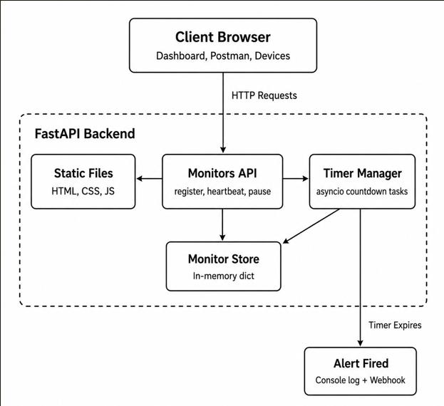

# Pulse-Check API — "Watchdog" Sentinel

A **Dead Man's Switch** API built for CritMon Servers Inc. to monitor remote
solar farms and unmanned weather stations. Devices register a monitor with a
countdown timer and must "ping" (heartbeat) before the timer expires. If they
don't, the system fires an alert and marks the device as `down`.

Built with **Python 3 + FastAPI**, using in-memory state and `asyncio`
background tasks to manage per-device countdown timers.

### Contents
1. [Architecture Diagram](#1-architecture-diagram)
2. [Setup Instructions](#2-setup-instructions)
3. [API Documentation](#3-api-documentation)
4. [Frontend Dashboard](#4-frontend-dashboard)
5. [The Developer's Choice](#5-the-developers-choice)
6. [Known Limitations / Future Improvements](#6-known-limitations--future-improvements)

---

## 1. Architecture Diagram



## 2. Setup Instructions

### Prerequisites
- Python 3.10+ (tested on 3.12)

### Steps

```bash
# 1. Clone your fork
git clone https://github.com/<your-username>/pulse-check-api.git
cd pulse-check-api

# 2. Create and activate a virtual environment
python3 -m venv .venv
source .venv/bin/activate        # Windows: .venv\Scripts\activate

# 3. Install dependencies
pip install -r requirements.txt

# 4. (Optional) Configure an alert webhook
cp .env.example .env
# edit .env and set ALERT_WEBHOOK_URL if you want alerts POSTed somewhere

# 5. Run the server
uvicorn app.main:app --reload

# 6. Open the dashboard
# http://127.0.0.1:8000

# 7. (Optional) Run the test suite
pytest -q
```

The interactive API docs (Swagger UI) are available at
`http://127.0.0.1:8000/docs`.

---

## 3. API Documentation

Base URL: `http://127.0.0.1:8000`

### `POST /monitors`
Register a new monitor and start its countdown.

**Request body**
```json
{
  "id": "device-123",
  "timeout": 60,
  "alert_email": "admin@critmon.com"
}
```

**Response — `201 Created`**
```json
{
  "message": "Monitor 'device-123' created. Countdown started for 60s.",
  "monitor": {
    "id": "device-123",
    "timeout": 60,
    "alert_email": "admin@critmon.com",
    "status": "active",
    "time_remaining": 60.0,
    "created_at": 1718000000.0,
    "last_heartbeat": 1718000000.0,
    "heartbeat_count": 0
  }
}
```

> Re-registering an existing `id` overwrites it and restarts its timer.

---

### `POST /monitors/{id}/heartbeat`
Reset the countdown ("I'm alive" signal).

- **200 OK** — timer reset to full `timeout`.
  - If the monitor was `paused`, it is automatically un-paused.
  - If the monitor was `down`, it is revived and the timer restarts.
- **404 Not Found** — if `{id}` does not exist.

**Response — `200 OK`**
```json
{
  "message": "Heartbeat received for 'device-123'. Timer reset.",
  "monitor": { "...": "..." }
}
```

---

### `POST /monitors/{id}/pause`
**(Bonus: Snooze)** Pause monitoring — stops the countdown completely, no
alerts fire while paused. Sending a heartbeat automatically un-pauses.

- **200 OK** — monitor paused.
- **404 Not Found** — if `{id}` does not exist.
- **409 Conflict** — if the monitor is already `down` (send a heartbeat to
  revive it instead).

---

### `GET /monitors/{id}`
**(Developer's Choice)** Get the live status of a single monitor, including
`time_remaining` in seconds.

- **200 OK**
- **404 Not Found**

---

### `GET /monitors`
List all monitors with their current status and time remaining. Used by the
dashboard for live polling.

---

### `DELETE /monitors/{id}`
Remove a monitor and cancel its background timer.

- **200 OK**
- **404 Not Found**

---

### Alert Output
When a monitor's timer reaches zero, the system logs (and optionally POSTs to
`ALERT_WEBHOOK_URL`):

```json
{
  "ALERT": "Device device-123 is down!",
  "time": 1718000123.45,
  "alert_email": "admin@critmon.com"
}
```

---

## 4. Frontend Dashboard

A lightweight static dashboard is served at `/` (no build step required) —
served directly by FastAPI's `StaticFiles`, so opening `http://127.0.0.1:8000`
in a browser is all that's needed.

**Features:**
- **Registration form** — create a new monitor (`id`, `timeout`, `alert_email`)
  directly from the browser, no curl/Postman required.
- **Live monitor table** — every registered monitor with a color-coded status
  badge (`active` = green, `paused` = yellow, `down` = red), live
  `time_remaining` countdown, timeout, heartbeat count, and alert email.
- **Per-monitor actions** — **Heartbeat**, **Pause**, and **Delete** buttons on
  each row, calling the corresponding API endpoints directly.
- **Auto-refresh** — polls `GET /monitors` every second, so the table reflects
  timer countdowns and the `down` state in near real-time without a page
  reload.

**Files:**
```
static/
├── index.html   # layout: registration form + monitors table
├── style.css    # dark theme, status badges, layout
└── script.js    # fetch calls, polling loop, button handlers
```

---

## 5. The Developer's Choice

Two additions beyond the core spec, chosen because they directly address the
gaps a support engineer would hit first in real operation:

### 5.1 Status endpoint + auto-revive on heartbeat

1. **`GET /monitors/{id}`** — returns a single monitor's live status,
   including `time_remaining` in seconds.
2. **Auto-revive** — if a device sends a heartbeat *after* its monitor has
   already gone `down`, the system automatically restores it to `active` and
   restarts the timer, rather than requiring a separate "reset" action.

**Why this matters:** in the real-world scenario, a solar farm device that
lost power and was manually repaired will simply start sending heartbeats
again once it's back online. Without auto-revive, a support engineer would
need a separate manual step to clear the `down` state — adding friction
exactly when the team is busy fixing the actual problem. The status endpoint
gives engineers a quick, single-call way to check "is this specific device
okay right now and how much time is left?", which is the most common
operational question this API needs to answer.

### 5.2 Live web dashboard

The API alone only answers questions you know to ask via curl/Postman/Swagger.
A support engineer monitoring dozens of devices needs an at-a-glance view of
*everything* — which is why a small static dashboard (`static/`) is bundled
and served directly from the FastAPI app at `/`.

**Why this matters:** this is the difference between "the system has the data
needed to tell us a device is down" and "a human actually notices in time to
act." The dashboard polls `GET /monitors` every second and renders color-coded
status badges, so a `down` device turns red on screen within a second of the
alert firing — no log-tailing or repeated API calls required. It also makes
the Heartbeat/Pause/Delete actions one click away, which is useful for demoing
the whole lifecycle (register → heartbeat → timeout → alert → revive) without
any external tooling.

---

## 6. Known Limitations / Future Improvements

- **In-memory storage**: all monitor state is lost if the server restarts.
  For production, this would be backed by a persistent store (e.g.
  Redis/Postgres) with deadlines recomputed from stored timestamps on boot.
- **Single process**: timers are `asyncio` tasks within one process; scaling
  to multiple workers would require a shared scheduler (e.g. Redis-backed
  job queue) instead of in-process tasks.
- **Email delivery is simulated**: alerts are logged to console (and
  optionally POSTed to a webhook) rather than sending real emails.